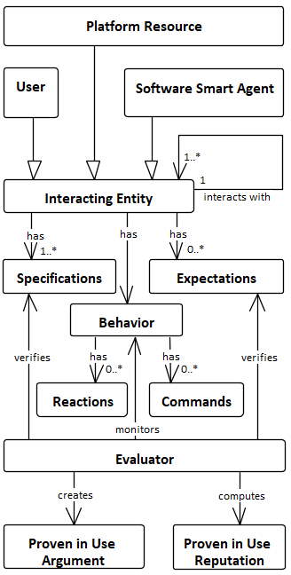
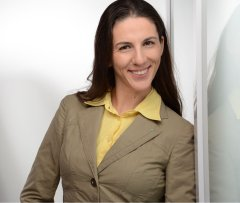

# <u>BUILDING TRUST IN THE UNTRUSTABLE</u>

## AUTHORS

This paper was written by *Emillia Cloraica, Barbora Buhnova, Thomas Kuhn and Daniel Schnelder.* 

## VENUE

*University of California at Irvine, USA.*

## DATE

*Fri 10 Jul 2020* on 42nd International Conference on Software Engineering.

[Paper Link](https://www.researchgate.net/publication/340377620_Building_Trust_in_the_Untrustable "a new site")

[Video Link](https://youtu.be/ndH1I2JOkoM "a new site")

## ABSTRACT

​		**S**umming up this we can understand that autonomous vehicles are more dangerous than humans cause human always works as an individual so the gravity of mishap is not so high cause its limited to few people but the fault in any autonomous vehicle system will lead you to the wholesome disaster. Initiating an unstoppable chain of deaths. *For that, we first need to upgrade the quality of software in order to make sure that whatever we are driving will not lead to such dangerous mishaps.*

​		In the scenario of trusting, Trust is major concert deriving out society, Trust plays major key role in adoptation of various inovations. Although the automatic deriving would decrease the number of accident accidently. 

​		To compute the level of trust we use different multitude of methods and Regarding a quantified  reputation, Scholars devide trust in two types, *Belief based trust* and *Computation based trust*. 

​		Previosely the concept of trust was about the various accord. Suppose *"Firm belief"*,*"Decision making"*, *"Behavior information"* and *"Feed back"* . But from the human perspective, some psychological terms while analysing trust in autonomic system are given below;

##### 	 *1. The moral and emotional aspects of trust*

​		The relationship of human with building trust is categarized into two, *morality* related with moral problems and *affect* related with emotions.

#####	*2. Trust in automated systems*	

​		After automatic system, People do have multiple of studies for the human trust in autonomous system, additionaly they do have created vatious models of trust after the development of autonomous system and man has to work on automatic system like monitor. 

##### 	*3. Historical adoption of technology*

​		The historical adoption  of technology in regarding of building trust is at large, stretch previously people were unware about the avionics and automative domains. With reference of time, technology touches to sky from the bottom of the earth. Previousely people merely used to live on earth, after using some technics they used to live in the sea and finally they used to live in space with the help of super technology. This is all about the adoptation of technology.

​		Architecture of this platform works like arm in both the development of trust and evolution of trust. This platform consists of following assets; An **Interacting Entity** is either the **user**, a **software smart agent**, or a **platform resource**, such as an ECU (Embedded Control Unit) to which a software smart agent is downloaded. An interacting entity triggers major decision events, which serve as **Commands** for the system and has observable **Reactions**. The entities can interact with each other and their behavior is supervised by an **Evaluator**. The Evaluator monitors the interacting entities and verifies the set of **Specifications** and **Expectations**, and then computes the **Proven-in-Use Reputation**. 

​                                                 **Logical view of platform**

## *Conclusion*  

​		From this paper we conclude, We use products and services uncosiously, Therefore autonomous system needs to be engineered around human pychological needs and we should be familiar in regard of technology or *simply we should be technically smart.*

 **Emilia Cioroaica** .jpg)  **Barbora Buhnova**

 .jpg) **Thomas Kuhn**            **Daniel Schneider**

  

